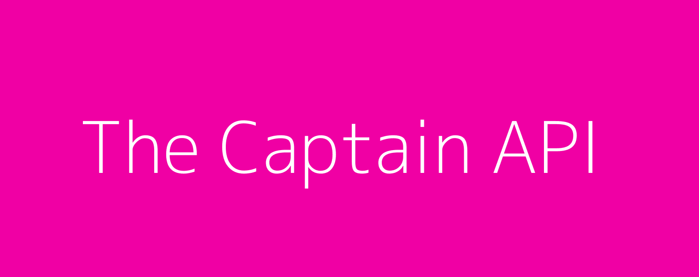

# The Captain API



This is the captain (or “myth") API. It contains simple endpoints for quick use on your basic projects.

## Endpoints

The following routes are accessible at the moment, all living under `/v1`:

- `/captain/adjectives/`, return one random Mariliz Pereira Jorge's adjective about The Captain.
- `/captain/adjectives/all`, return the full list of adjectives.

For example, to get a single adjective you may access the heroku (free!) deploy at https://powerful-waters-90294.herokuapp.com/v1/captain/adjectives

## Developing 

### Run it Locally

The Captain API is a Node.js app using [Express 4](http://expressjs.com/). Make sure you have [Node.js](http://nodejs.org/) and the [Heroku CLI](https://cli.heroku.com/) installed to run it locally.

```sh
$ git clone https://github.com/tiagovignatti/the-captain-api # or clone your own fork
$ cd the-captain-api
$ npm install
$ npm start # or heroku local web
```

Your app should now be running on [localhost:5000](http://localhost:5000/).

### Deploying to Heroku

```
$ heroku create
$ git push heroku main
$ heroku open
```

## License

[MIT license](LICENSE) © Tiago Vignatti